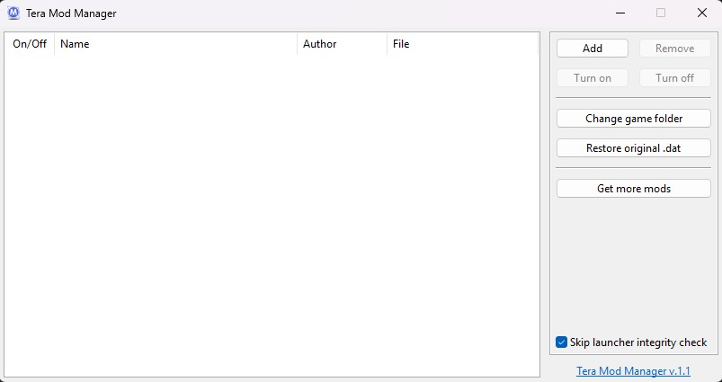

## TMM (Tera Mod Manager)
> Tera Online 64-bit composite GPK mod manager. Allows you to install and manage composite GPK mods without manual CompositePackageMapper.dat patching.
> Supports mods created by [Real Editor](https://github.com/VenoMKO/RealEditor#real-editor) version 1.0 and higher.

I had annoyance with the integrity check not being enabled upon launch despite the box being ticked from the previous session, so decided to give this project a refresh!
Enjoy!

### Download

You can get the latest version in the ['Releases' section](https://github.com/BorkyCode/TMM/releases).

### Install

1. Download and extract the TMM.
2. Start the TMM.exe.
3. Specify your game folder(e.g. D:\Games\Gameforge\tera\Client\S1Game).
4. If missing CompositePackageMapper.clean, go to CookedPC directory and save a copy of CompositePackageMapper.dat as .clean
5. **KR\TW\Starscape** players: Turn on **Skip launcher integrity check** option.

> **EU\NA\SEA:**
After adding mods you can close the TMM. You don't need to start it every time you want to play Tera.

> **KR\TW\JP\Starscape:**
You need to start TMM every time you want to play Tera and keep it open until you exit the game.

### How to create mods

You can use Real Editor to create 64-bit mods. More info here: [Real Editor - Wiki](https://github.com/VenoMKO/RealEditor/wiki)
